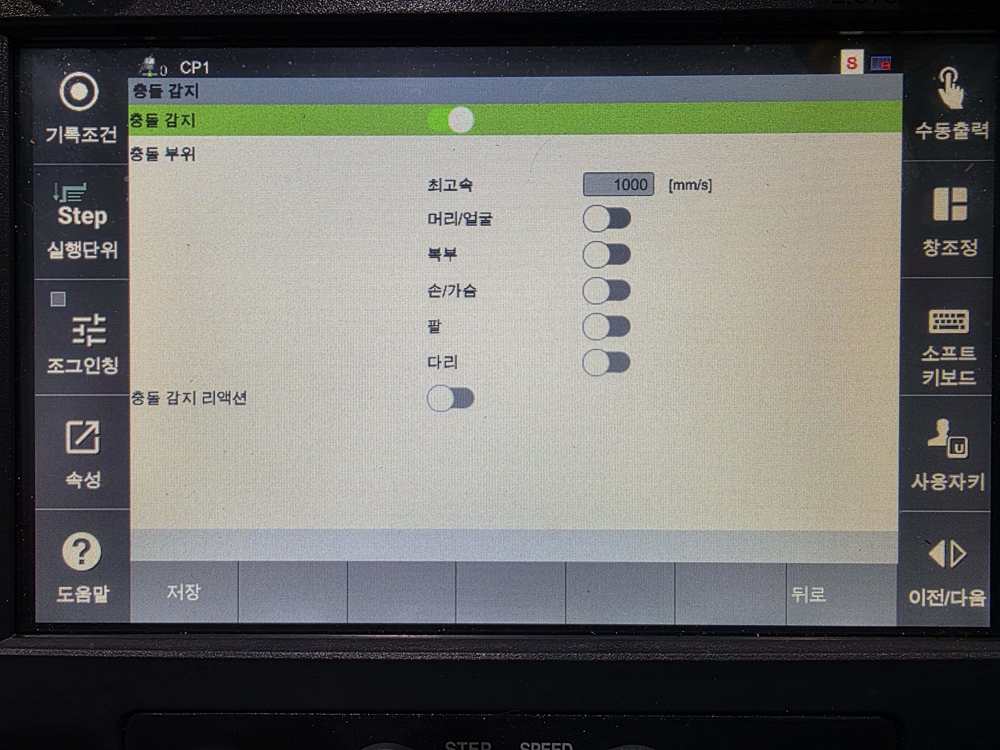

# 1.11.1 협동로봇 충돌감지 제어기 설정

1.  운전 방식을 수동 모드로 설정하십시오.

2.  **\[시스템]** 버튼 > **\[11: 협동 로봇 시스템]** >**\[ 충돌감지]** 메뉴를 터치하십시오.

3. 협동로봇의 충돌감지 기능의 사용 여부와 옵션을 설정한 후 **\[OK]** 버튼을 터치하십시오.

* **\[감지]**: 충돌검지 기능의 사용 여부를 설정합니다.
* **\[충돌 부위]**: 충돌감지 시 상해 최소 안전 보장 가능한 로봇의 최대속도를 적용하기 위한 신체 부위를 선택합니다.
* **\[충돌 감지 리액션]**: 충돌 감지 후 회피 동작 실행 여부를 선택합니다.


**\[주의]**

* 툴 데이터가 실제 값과 오차가 클 경우 충돌을 잘못 감지할 수 있습니다. 길이나 무게, 무게 중심 등의 툴 관련 정보를 정확하게 설정하십시오. 또한 로봇의 설치 각도 및 중력 방향을 반드시 확인하십시오. 툴 데이터를 정확히 설정해도 오감지가 발생한다면 엔코더 및 기속도 센서를 점검하십시오.

