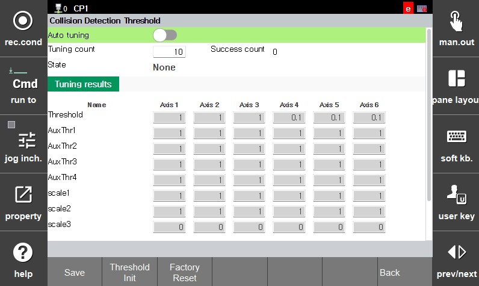

# 1.11.3 Collaborative Robot Collision Detection Auto-Tuning Mode

1.  Please set the driving mode to manual.

2.  **\[system]**  > **\[11: Cobot System ]** > **\[5: Collision Dectection Threshold]** Please touch the menu.

3.  **\[Threshold Init]**  Please touch the button.

4. After configuring whether to enable the automatic tuning function for the collaborative robot's collision detection threshold and setting the number of execution cycles, touch the **\[Save]** button.

* **\[Auto tuning]**: Configure whether to enable the collision detection auto-tuning function.
* **\[Tuning count]**: Set the number of job executions for performing automatic collision detection tuning.
* **\[Threshold Init]**: Resets the collision detection threshold.
* **\[Factory Reset]**: Resets the collision detection threshold to the factory default value.


**\[warning]**

* Ensure that the robot is not subjected to external impacts while the auto-tuning function is running. If an external impact occurs during execution, please reset and restart the auto-tuning process. 
If the number of auto-tuning iterations is set too low, the process may finish before optimization is complete, potentially leading to frequent false detections; conversely, if the number is set too high, the process may take an excessive amount of time to complete, depending on the execution job's duration. We recommend setting the number of iterations between 100 and 200 for a job with a one-minute execution time. 
Please note that this function operates only in Auto mode; in Manual mode, the collision detection function operates using factory default settings.

