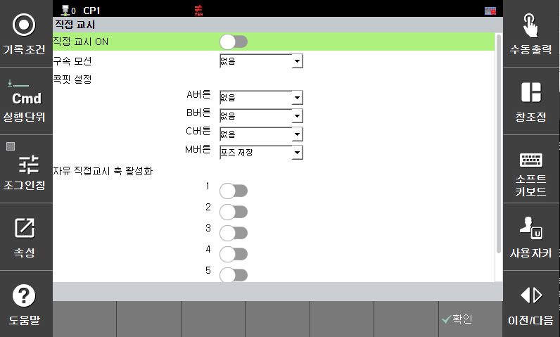
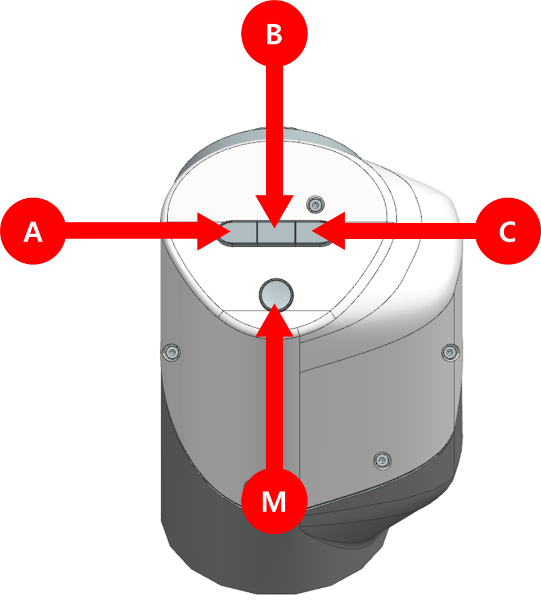

# 1.4.1 협동로봇 직접교시 제어기 설정

1.  운전 방식을 수동 모드로 설정하십시오.

2.  **\[설정]** 버튼 > **\[11: 협동로봇 시스템 > 직접교시]** 메뉴를 터치하십시오.

3. 협동로봇의 직접교시 기능의 사용 여부와 옵션을 설정한 후 **\[OK]** 버튼을 터치하십시오.

* **직접 교시(Direct teaching On)**: 모터온 시 바로 직접교시로 동작합니다.(SHIFT + MOT. ON + Enable Switch) Enable Switch가 눌러져 있어야만 모터온이며, 직접교시가 구동된다. 다시 조그나 자동으로 로봇을 원할 경우 설정내 '직접교시 ON (Direct teaching On)'를 OFF 해야함 
* **구속 모션(Constraint motion)**: 직접교시가 실행될때 기본 모드를 결정합니다. '없음'을 선택했을 경우 FREE 모드로 실행 되며, 모터온 중 다른 모드로 바꾸지 못하지만 그 외 다른 모드에선 직접교시 실행 중 모드 변경이 가능합니다.

 

4. 위 사진은 협동로봇 시리즈 HDC에 부착된 콕핏 버튼을 형상황한 그림입니다. 참고하여 아래 콕핏 설정을 읽어주시기 바랍니다.
* **콕핏 설정(Cockpit setting)**: 콕핏 버튼(Cockpit)의 모드를 결정합니다. 
- 각각의 '콕핏 A, B, C 버튼'은 아래의 보기중 하나의 기능을 가질 수 있습니다.
    - 'XYZ' = X, Y, Z 제외 cartesian 구속 모션으로 직접교시 모드를 변경합니다.(직접교시 구속모션 중에만 가능)
    - 'XY'  = X, Y 제외 cartesian 구속 모션으로 직접교시 모드를 변경합니다.(직접교시 구속모션 중에만 가능) 
    - 'X'   = X 제외 cartesian 구속 모션으로 직접교시 모드를 변경합니다.(직접교시 구속모션 중에만 가능)
    - 'Y'   = Y 제외 cartesian 구속 모션으로 직접교시 모드를 변경합니다.(직접교시 구속모션 중에만 가능)
    - 'Z'   = Z 제외 cartesian 구속 모션으로 직접교시 모드를 변경합니다.(직접교시 구속모션 중에만 가능)
    - 'Rx'  = Rx 제외 cartesian 구속 모션으로 직접교시 모드를 변경합니다.(직접교시 구속모션 중에만 가능)
    - 'Ry'  = Ry 제외 cartesian 구속 모션으로 직접교시 모드를 변경합니다.(직접교시 구속모션 중에만 가능)
    - 'Rz'  = Rz 제외 cartesian 구속 모션으로 직접교시 모드를 변경합니다.(직접교시 구속모션 중에만 가능)
    - '없음(None)'= 눌러도 변화가 없습니다.

- '콕핏 M 버튼'은 아래 보기와 같은 메뉴를 갖습니다.
    - '포즈 저장' = 로봇의 현재 위치를 현재 TP상 열려있는 잡파일에 기록합니다. 

* **자유 직접교시 축 활성화(Joint Direct Teaching Axis Activate)**:자율 직접교시 중 활성화시에만 선택한 축 구동가능


**\[주의]**

* 툴 데이터가 실제 값과 오차가 클 경우 직접교시가 실행되지 않을 수 있습니다. 직접교시가 계속 실행되지 않을 경우 로봇을 멈추고 툴 데이터 입력값을 확인하기 바랍니다.
* 직접교시를 실행하고 할때 motor on/Enable Switch/shift를 동시에 눌러주시기 바랍니다.
* 모터온 후 Enable Switch를 누르고 계셔야만 직접교시가 계속 실행됩니다.
* 직접교시 실행 중 'Direct teaching On'을 off로 변경하시거나 Enable Switch에서 손을 때시면 직접교시가 정지 됩니다.
* 직접교시 실행시 로봇 주변 사물이나 사람을 확인후 동작해주시기 바랍니다.
* 두개 이상의 버튼이 동시에 눌러질 경우 처음 누른 버튼만 인식합니다.
* 직접교시 중 TP를 이용하여 로봇을 자동으로 돌릴 경우 로봇이 바로 정지합니다. 이 경우 긴급 정리이기 때문에 위험합니다.

