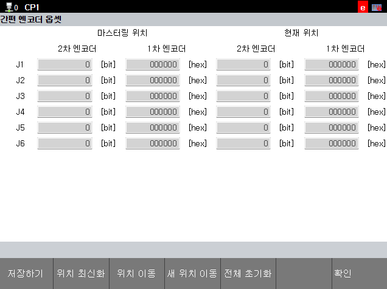

# 1.5.1 Simple Mastering Position Setting

The robot requires mastering at a specific position; this section explains how to designate that position. Since the robot moves when the mastering position is set, care must be taken to avoid collisions with people or objects in the vicinity. Note that while there are various possible mastering positions, the system selects a position close to the robot's current posture.

-  **\[system]** > **\[11: Cobot System ]** > **\[11: Simple Encoder Offest ]** Please touch the menu.
- The 'Mastering Position' section displays 'Secondary Encoder' and 'Primary Encoder' values, representing the encoder readings for each joint when the robot is at the mastering position.
- To register a new mastering position, touch the 'Move to New Position' button at the bottom.
    - When the button is touched, the robot moves from its current location to the mastering position.
    - Keep touching the button until the movement is complete; the robot will stop if you release it.
    - Once the movement is complete, touch the 'Update Position' button.
    - Touch the 'Save' button.

    



**\[Warning]**
* Tapping the 'Update Position' button without moving to the mastering position will not update the mastering position.
* You must move to the mastering position, tap the 'Update Position' button, and save the setting to establish the new mastering position.
* You must set a new mastering position in the following cases. Using the previously registered mastering position may result in improper mastering or accidents.
    - Secondary encoder replacement
    - Encoder initialization in the  **\[system]** > **\[3: Robot Parameters]** > **\[4: Encoder Offset]** menu
