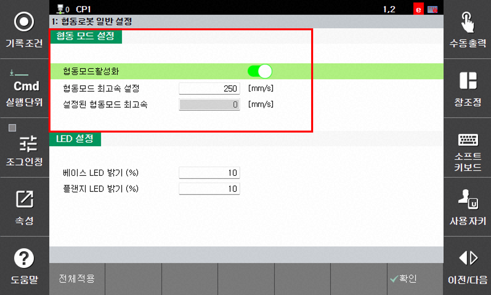

# 1.6.1 협동 모드 설정

협동 모드란? 협동 로봇과 사람의 충돌이 생겼을때를 대비하여, 최고속을 제한하는 모드입니다. 제한된 최고속 이상의 속도로 로봇을 구동하고 싶다면 산업용 로봇 기준의 위험성 평가 후 협동 모드를 해제하시면 됩니다.

- `[F2: 시스템] - 11: 협동로봇 시스템 - 협동 로봇 일반 설정` 메뉴를 터치하십시오.
- 협동모드 활성화가 ON 되어있는지 확인합니다.(디폴트 : ON)
- 협동로봇의 협동 모드및 최고속을 설정하고 전체 적용을 클릭하여 저장하십시오.
     
    - 협동 모드 활성화 :  협동 모드 사용 여부를 설정합니다. 
    - 협동 모드 최고속 설정 : 사용자가 입력할 협동모드 최고속입니다. 250 ~ 1000 mm/s 사이 값을 입력할 수 있습니다.(디폴트 : 800 mm/s)
    - 설정된 협동 모드 최고속 : 현재 협동 로봇의 최고속을 알려줍니다. 위 기능은 충돌감지 및 안전 모션내 설정값까지 반영된 최종 최고속입니다.


**\[주의]**
* 협동 모드를 OFF하시기 전에 반드시 산업용 로봇 기준의 위험성 평가를 진행하십시오
* 레이더 감지로 인한 감속으로 변경된 최고속은 "설정된 협동 모드 최고속"에 반영되지 않습니다.
