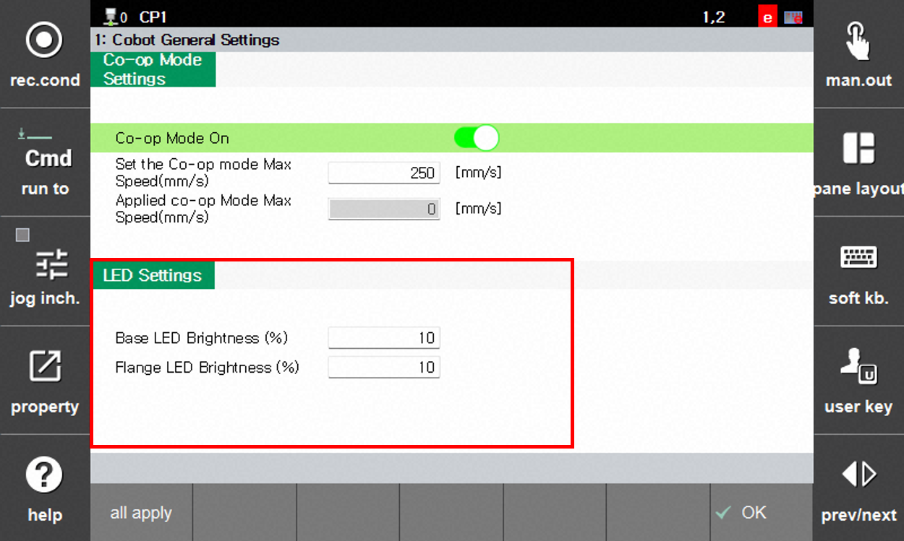

# 1.6.2 LED 설정

LED 밝기 설정 및 LED 색상 별 의미를 나타냅니다. 색상은 변경할 수 없으며, 밝기만 조절 가능합니다.

- `[F2: 시스템] - 11: 협동로봇 시스템 - 협동 로봇 일반 설정` 메뉴를 터치하십시오.
- LED 설정 값을 입력하고 전체적용을 클릭하여 저장하십시오.
     
    - 베이스 LED 밝기 (%) : 1축에 장착된 LED 밝기를 조절합니다. (디폴트 : 10%)
    - 플랜지 LED 밝기 (%) : 6축에 장착된 LED 밝기를 조절합니다.(디폴트 : 10%)
    - 전체 적용 클릭 후 맞는 비밀번호를 입력해야 저장됩니다. 

    


**\[주의]**
* 100%로 계속 LED를 켜둘 경우 성능이 저하될 수 있습니다.



LED 색상별 로봇 상태는 다음과 같습니다.
<table>
  <thead>
    <tr>
      <th style="text-align: center;">색</th>
      <th style="text-align: center;">상태</th>
    </tr>
  </thead>
  <tbody>
    <tr>
      <td style="text-align: center;">빨간색</td>
      <td>에러, 비상정지, 레이더에 의한 로봇 정지</td>
    </tr>
    <tr>
      <td style="text-align: center;">녹색</td>
      <td>자동 모드</td>
    </tr>
    <tr>
      <td style="text-align: center;">파란색</td>
      <td>수동 모드(모터 On)</td>
    </tr>
    <tr>
      <td style="text-align: center;">흰색</td>
      <td>수동 모드(모터 Off)</td>
    </tr>
    <tr>
      <td style="text-align: center;">파란색 깜박임</td>
      <td>직접 교시 모드</td>
    </tr>
    <tr>
      <td style="text-align: center;">노란색 깜박임</td>
      <td>경고, 레이더에 의한 로봇 감속</td>
    </tr>
  </tbody>
</table>
