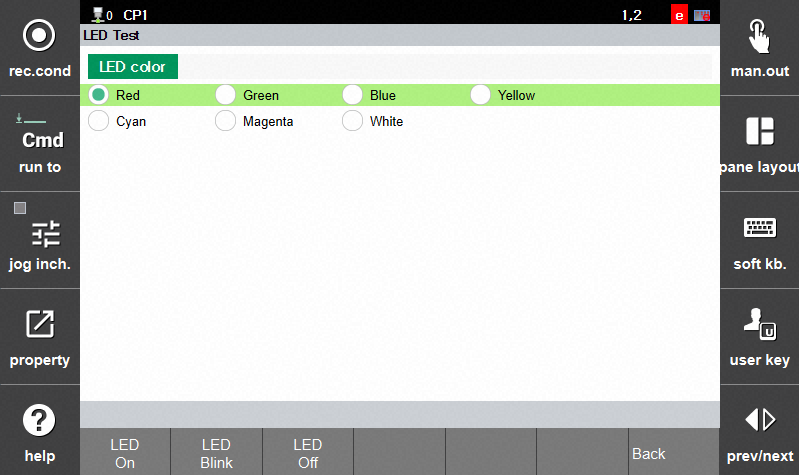

# 1.7 LED test

This function allows you to test the collaborative robot LED.

 

- Go to engineer mode and tap `[F2: system] - 11: Cobot System - LED test`.
- Select the LED color you want to test.
- Tap the 'LED On' button to turn on the selected color.
- Tap the 'LED Blink' button to make the selected color blink.
- Tap the 'LED Off' button to turn off the LED.
