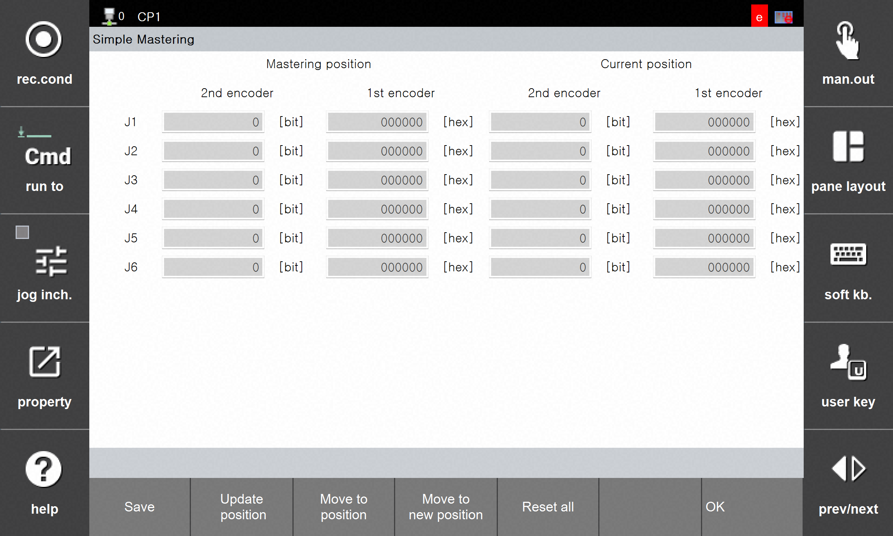

# 3.3.2 Simple Mastering Execution

This section explains how to perform mastering after the robot moves to the designated mastering position. Since the robot moves to the mastering position, take care to avoid collisions with people or objects in the surrounding area.

- After entering engineer mode, touch the `[F2: system] - 11: Cobot System - Simple Mastering` menu.
- The 'Current Position' section displays the 'Secondary Encoder' and 'Primary Encoder' values ​​for each joint at the robot's current location.
- Touch the 'Move to Position' button at the bottom to move the robot to the mastering position.
    - The robot moves to the mastering position when the button is touched.
    - Keep touching the button until the movement is complete; the robot will stop if you release it.
    - Once the movement is complete, touch the 'Full Reset' button.
    - Touch the 'Save' button.
    - Reboot the controller.

    


**\[Warning]**
* A mastering position must be registered to use the simple mastering function.
* If the robot does not move to the mastering position before the 'Reset All' button is touched, mastering will not be performed.
* Mastering is completed only after saving following 'Reset All'.
* If a warning or error related to the encoder occurs, simple mastering may not function properly.
* Frequent use of the simple mastering degrades mastering performance; please use it only when necessary.
    
