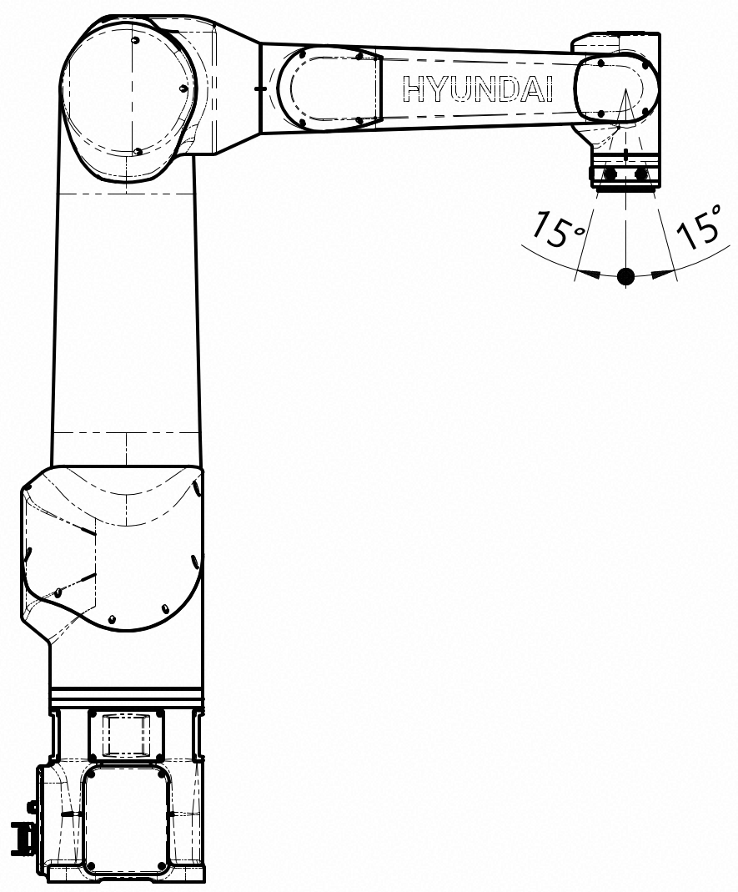

# 3.4 플랜지 아래 방향 제한

<mark style="color:green;">본 기능은 HDC50-17에서만 사용됩니다.</mark> 
HDC50-17은 플랜지 Z축과 지면의 수직 방향 사이의 각도가 15° 이내로 유지되어야 합니다.
해당 각도가 15°를 초과하면 로봇이 정지합니다.

 

각도가 15°를 초과하여 로봇이 정지한 경우, 조그가 제한될 수 있습니다.
이 경우 다음 절차에 따라 로봇을 조작하여 플랜지 Z축과 지면의 수직 방향 사이의 각도가 15° 이내가 되도록 하십시오.

- 엔지니어 모드에서 `[F2: 시스템] - 3: 로봇 파라미터 - 3: 소프트 리밋` 메뉴를 선택하십시오.
- 모터온 후 조그하여 플랜지 Z축과 지면의 수직 방향 사이의 각도가 15° 이내가 되도록 하십시오.


**\[주의]**
* `소프트 리밋` 메뉴에 진입 후 로봇 조그 시 플랜지 Z축과 지면의 수직 방향 사이의 각도가 15°를 초과하지 않도록 주의하십시오.
